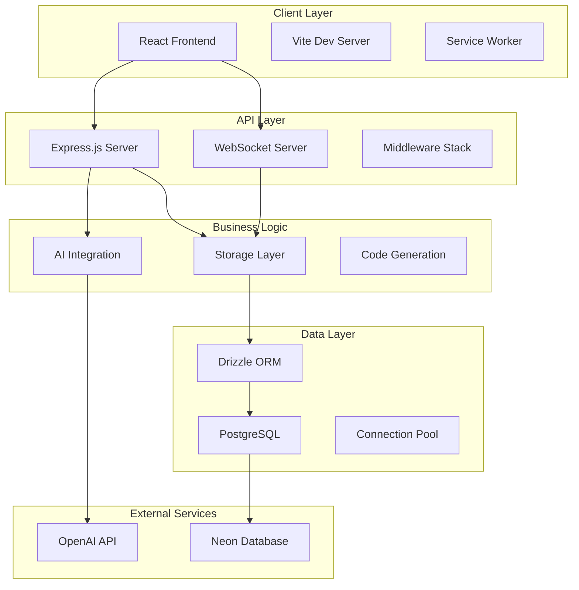
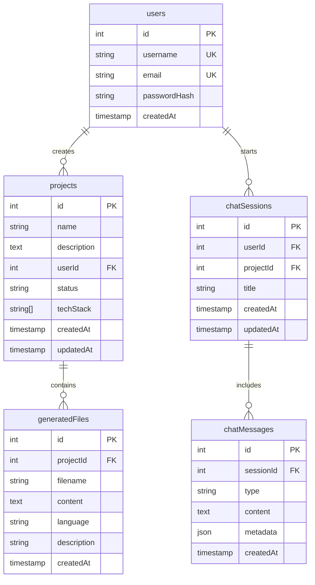
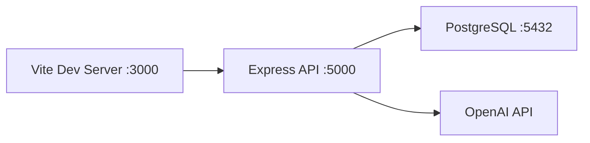
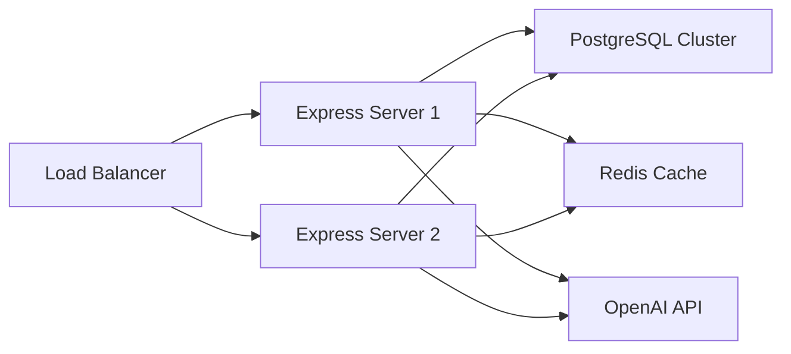

# システムアーキテクチャ

## 概要

Code Architect AIは、モダンなフルスタックWebアプリケーションとして設計されており、スケーラブルで保守性の高いアーキテクチャを採用しています。

## アーキテクチャ図



## コンポーネント詳細

### フロントエンド アーキテクチャ

#### React コンポーネント構成
```
client/src/
├── components/
│   ├── ui/              # 基本UIコンポーネント
│   │   ├── button.tsx
│   │   ├── card.tsx
│   │   └── input.tsx
│   ├── layout/          # レイアウト関連
│   │   ├── AppLayout.tsx
│   │   └── Sidebar.tsx
│   ├── chat/           # チャット機能
│   │   ├── ChatMessage.tsx
│   │   ├── ChatInput.tsx
│   │   └── ChatHistory.tsx
│   └── projects/       # プロジェクト管理
│       ├── ProjectCard.tsx
│       ├── ProjectList.tsx
│       └── ProjectTemplates.tsx
├── pages/              # ページコンポーネント
│   ├── Index.tsx
│   ├── Dashboard.tsx
│   ├── Chat.tsx
│   └── Projects.tsx
├── hooks/              # カスタムフック
│   ├── useWebSocket.ts
│   └── use-toast.ts
└── lib/                # ユーティリティ
    ├── queryClient.ts
    └── utils.ts
```

#### 状態管理戦略
- **Server State**: TanStack Query によるキャッシング
- **Client State**: React の useState/useReducer
- **Global State**: Context API (認証状態など)
- **WebSocket State**: カスタムフック useWebSocket

### バックエンド アーキテクチャ

#### レイヤー構成
```
server/
├── index.ts           # アプリケーション エントリーポイント
├── routes.ts          # APIルート定義
├── storage.ts         # データアクセス層
├── db.ts             # データベース接続
├── openai.ts         # AI統合
└── vite.ts           # フロントエンド統合
```

#### データフロー
```
Request → Middleware → Router → Storage → Database
                                    ↓
Response ← JSON ← Business Logic ← Data
```

### データベース設計

#### エンティティ関係図


## 設計原則

### 1. 責任の分離 (Separation of Concerns)
- **プレゼンテーション層**: React コンポーネント
- **ビジネスロジック層**: Express ルートハンドラ
- **データアクセス層**: Drizzle ORM + Storage クラス
- **データ永続化層**: PostgreSQL

### 2. 依存性注入 (Dependency Injection)
```typescript
// IStorage インターフェースによる抽象化
interface IStorage {
  getUser(id: number): Promise<User | undefined>;
  createProject(project: InsertProject): Promise<Project>;
}

// 実装の交換可能性
const storage: IStorage = new DatabaseStorage();
// または
const storage: IStorage = new MemoryStorage();
```

### 3. 型安全性 (Type Safety)
```typescript
// 共有型定義
// shared/schema.ts
export type Project = typeof projects.$inferSelect;
export type InsertProject = typeof projects.$inferInsert;

// フロントエンドとバックエンドで共有
// client/src/types.ts と server/types.ts は shared/ を参照
```

### 4. エラー処理
```typescript
// 統一されたエラーハンドリング
app.use((err: Error, req: Request, res: Response, next: NextFunction) => {
  const errorResponse = {
    error: err.message,
    status: 'error',
    ...(process.env.NODE_ENV === 'development' && { stack: err.stack })
  };
  
  res.status(500).json(errorResponse);
});
```

## スケーラビリティ考慮事項

### 水平スケーリング
- **ステートレス設計**: セッションはデータベースに保存
- **ロードバランサ対応**: Sticky Session 不要
- **マイクロサービス化**: 将来的な分割が容易な設計

### パフォーマンス最適化
- **データベース最適化**: 適切なインデックス設計
- **キャッシュ戦略**: TanStack Query によるクライアント側キャッシュ
- **コード分割**: Dynamic Imports による遅延読み込み

### リアルタイム通信
```typescript
// WebSocket アーキテクチャ
const wss = new WebSocketServer({ 
  server: httpServer, 
  path: '/ws' 
});

// 接続管理
const connections = new Map<string, WebSocket>();

// ブロードキャスト機能
function broadcastToProject(projectId: number, message: any) {
  connections.forEach((ws, connectionId) => {
    if (ws.readyState === WebSocket.OPEN) {
      ws.send(JSON.stringify(message));
    }
  });
}
```

## セキュリティ アーキテクチャ

### 認証・認可
- **セッションベース認証**: express-session + PostgreSQL
- **将来的なJWT対応**: 準備済み
- **ロール基づくアクセス制御**: 実装予定

### データ保護
```typescript
// 入力検証
const createProjectSchema = z.object({
  name: z.string().min(1).max(255),
  description: z.string().max(2000).optional(),
  techStack: z.array(z.string()).max(10)
});

// SQLインジェクション対策
// Drizzle ORM による準備済みステートメント
const project = await db
  .select()
  .from(projects)
  .where(eq(projects.id, projectId));
```

### レート制限
```typescript
import rateLimit from 'express-rate-limit';

const limiter = rateLimit({
  windowMs: 15 * 60 * 1000, // 15分
  max: 100, // IP あたりのリクエスト数制限
});

app.use('/api/', limiter);
```

## デプロイメント アーキテクチャ

### 開発環境


### 本番環境


### コンテナ化
```dockerfile
# マルチステージビルド
FROM node:18-alpine AS builder
WORKDIR /app
COPY package*.json ./
RUN npm ci --only=production

FROM node:18-alpine AS runtime
WORKDIR /app
COPY --from=builder /app/node_modules ./node_modules
COPY . .
RUN npm run build
EXPOSE 5000
CMD ["npm", "start"]
```

## モニタリング & 可観測性

### メトリクス収集
- **アプリケーション メトリクス**: レスポンス時間、エラー率
- **システム メトリクス**: CPU、メモリ、ディスク使用量
- **ビジネス メトリクス**: プロジェクト作成数、AI生成回数

### ログ管理
```typescript
import winston from 'winston';

const logger = winston.createLogger({
  level: 'info',
  format: winston.format.combine(
    winston.format.timestamp(),
    winston.format.json()
  ),
  transports: [
    new winston.transports.File({ filename: 'app.log' }),
    new winston.transports.Console()
  ]
});
```

### ヘルスチェック
```typescript
app.get('/api/health', async (req, res) => {
  const health = {
    status: 'OK',
    timestamp: new Date().toISOString(),
    services: {
      database: await checkDatabaseHealth(),
      openai: await checkOpenAIHealth()
    }
  };
  
  res.json(health);
});
```

## 今後の拡張計画

### フェーズ 1: 機能拡張
- [ ] 多言語コード生成 (Python, Go)
- [ ] テストコード自動生成
- [ ] API ドキュメント自動生成

### フェーズ 2: 企業向け機能
- [ ] チーム管理機能
- [ ] プロジェクト共有
- [ ] 使用量分析

### フェーズ 3: マイクロサービス化
- [ ] コード生成サービス分離
- [ ] ユーザー管理サービス分離
- [ ] ファイル管理サービス分離

---

*システムアーキテクチャに関する質問や提案は、開発チームまでお気軽にご連絡ください。*